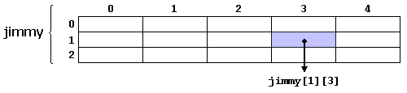
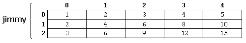

Št 4.10.2018

# Pole

Pole je postupnosť elementov rovnakého typu uložených v po sebe nasledujúcich
miestach pamäte, pričom na jednotlivé elementy sa môžeme odkazovať pomocou
indexov.

To znamená, že napríklad päť hodnôt typu int môže byť deklarovaných
 ako pole bez toho, aby bolo potrebné deklarovať 5 rôznych premenných 
 (každú s vlastným identifikátorom). Namiesto toho pomocou poľa 
 je päť hodnôt int uložených v susedných miestach pamäte a ku všetkým
 piatim sa dá pristupovať pomocou rovnakého identifikátora s príslušným 
 indexom.
 
 Napr. pole obsahujúce 5 int hodnôt nazvané foo by sme mohli reprezentovať 
 nasledovne
 
 


kde každý prázdny panel predstavuje prvok poľa. V tomto prípade ide o 
hodnoty typu int. Tieto prvky sú očíslované od 0 do 4, pričom 0 je prvý 
a 4 posledný; V C ++ je prvý prvok v poli vždy očíslovaný nula (nie 
jedna), bez ohľadu na jeho dĺžku.

Rovnako ako bežná premenná, aj pole sa musí deklarovať skôr, než sa 
použije. 
Typická deklarácia poľa v C ++ je :


```c++
typ nazov [pct elementov];
```

kde typ je dátový typ (napr. int, float ...), názov je identifikátor
 a pct elementov (ktorý je vždy uzavretý v hranatých zátvorkách []), 
 určuje dĺžku poľa z hľadiska počtu prvkov.
 
 
 Preto pole foo s piatimi prvkami typu int môžme deklarovať ako:

```c++
int foo [5];
```

## Inicializácia poľa

Defaultne sú lokálne (tj. tie, ktoré sú deklarované v rámci funkcie) 
polia neinicializované. To znamená, že žiadny prvok poľa nie je nastavený
na žiadnu konkrétnu hodnotu.

Elementy poľa ale môžeme pri deklarácii explicitne inicializovať
priložením počiatočných hodnôt do zátvoriek {}. Napríklad:

```c++
int foo [5] = { 16, 2, 77, 40, 12071 }; 

```
Tento príkaz deklaruje pole, ktoré môžeme reprezentovať takto:

 
 
 
 Počet hodnôt medzi zátvorkami {} nesmie byť väčší ako počet prvkov 
 v poli. Napríklad vo vyššie uvedenom príklade bolo foo deklarované s
  5 prvkami (číslom v 
  hranatých zátvorkách, []) a zátvorky {} obsahovali presne 5 hodnôt, 
  jednu pre každý prvok. Ak by obsahovali menej hodnôt, zostávajúce 
  prvky by sa vyplnili na nuly. Napríklad:


```c++
int bar [5] = { 10, 20, 30 }; 
```

Vytvorí toto pole:

 
 
 Inicializačné zátvorky môžu byť dokonca prázdne:
 
 ```c++ 
int baz [5] = { }; 
```

Týmto sa vytvorí pole piatich hodnôt int, z ktorých každá je 
inicializovaná hodnotou nula:

 
 
 Ak sú inicializačné zátvorky {} vyplnené, C++ umožňuje, aby sa hranaté
 zátvorky [] nechali prázdne.  V tomto prípade 
  kompilátor automaticky vytvorí pole veľkosti
  počtu hodnôt v inicializačných zátvorkách:
  
  
  ```c++ 	
int foo [] = { 16, 2, 77, 40, 12071 };
 ```
 
 Po tejto inicializácii by bolo pole foo dlhé 5 int,
  pretože sme poskytli 5 inicializačných hodnôt.
 
 
Vývoj C ++ viedol k tomu, že inicializovať možno aj bez operátora =, tj.
 oba tieto príkazy sú ekvivalentné:
   ```c++ 	
 int foo[] = { 10, 20, 30 };
 int foo[] { 10, 20, 30 }; 
  ```
  
  ## Prístup k hodnotám poľa
  
  Hodnota ľubovoľného prvku v poli môže byť prístupná rovnako ako 
  hodnota bežnej premennej rovnakého typu. Syntax je:
  
   ```c++ 
  nazov[index] 
  ```
  
  Po predchádzajúcich príkladoch, v ktorých pole foo malo 5 prvkov
   a každý z týchto prvkov bol typu int, názov, ktorý možno použiť 
   na označenie každého prvku jednotlivo, je nasledujúci:
   
  
  
  Napríklad nasledujúci príkaz uloží hodnotu 75 v treťom prvku foo:
  
  ```c++ 	
foo [2] = 75; 
  ```
  
  a napríklad nasledujúci príkaz priradí kópiu hodnoty tretieho prvku poĺa
   foo do premennej nazvanej x:
   
   ```c++ 
   x = foo[2];
   ```
   
   Tj. výraz foo [2]  je sám osebe premennou typu int.
   
   Všimnite si, že tretí prvok foo je foo [2], pretože prvý
    je foo [0], druhý je foo [1], a preto tretí je foo [2].
     Z toho istého dôvodu je jeho posledným prvkom foo [4]. 
     Preto ak budeme písať foo [5], budeme pristupovať k šiestemu
      prvku foo, a preto prekročíme veľkosť poľa.
    
    
   Prekročenie platného rozsahu indexov poľa je v C++ syntaktickz validné.
   To môže spôsobovať problémy, pretože prístup k elementom 
       mimo dosah nespôsobuje chyby pri kompilácii, ale môže spôsobiť 
       chyby počas behu programu.  Dôvod, prečo je to povolené, budeme vidieť,
       keď zavedieme ukazatele.
    
### Dôležité 
dva spôsoby použitia hranatých zátvoriek []:
1. určenie veľkosti poľa pri deklarácii
2. špecifikácia indexu elementu poľa pri prístupe na daný element


```c++ 
int foo[5];         // deklaracia noveho pola
foo[2] = 75;        // pristup na element pola
  ```  
  
  Hlavný rozdiel = deklarácii predchádza typ prvkov, zatiaľ čo prístupu na prvok nie
  
 ```c++ 
  foo[0] = a;
  foo[a] = 75;
  b = foo [a+2];
  foo[foo[a]] = foo[2] + 5;
 ```

 
    PRÍKLAD:
    
    
 ```c++ 
   #include <iostream>
   using namespace std;
   
   int foo [] = {16, 2, 77, 40, 12071};
   int n, result=0;
   
   int main ()
   {
     for ( n=0 ; n<5 ; ++n )
     {
        cout << foo[n] << endl;
     }
     return 0;
   }  
  ```
  
  ÚLOHA: Upravte program tak, aby vypočítal súčet prvkov poľa foo
  
  ## Viacdimenzionálne polia
  
  Viacdimenzionálne polia môžeme popísať ako "polia polí".
 Napríklad dvojrozmerné pole si môžeme predstaviť ako dvojrozmernú 
 tabuľku zostavenú z prvkov, ktoré sú rovnakého dátovéhoho typu.
  
  
  
  
  jimmy predstavuje dvojrozmerné pole 3 x 5 prvkov typu int. 
  Syntax C ++ pre deklaráciu tohto poľa je:
  
      
 ```c++ 
  int jimmy [3][5];
      
 ```
 
 a napríklad spôsob, ako sa odkázať na prvok v druhom stĺpci a štvrtom
 riadku je:
 
  ```c++ 
 jimmy[1][3]
  ```
 
  
  
  
(!pamätajte, že indexy poľa vždy začínajú nulou).


Viacdimenzionálne polia nie sú obmedzené na dva indexy
 (t.j. Dva rozmery). Môžu obsahovať toľko indexov, koľko je potrebné.
  Aj keď pozor: množstvo pamäte potrebnej pre pole sa exponenciálne
   zvyšuje s každou dimenziou. Napríklad:
   
   ```c++ 
   char century [100][365][24][60][60];
   ```
    
   deklaruje pole s prvkom typu char pre každú sekundu v storočí - 
   to predstavuje viac ako 3 miliardy znakov. Takže táto deklarácia
    by spotrebovala viac ako 3GB pamäte!
  
  
  
  Viacdimenzionálne polia sú konieckoncov len abstrakciou pre 
  programátorov, pretože rovnaké výsledky je možné dosiahnuť 
  použitím jednorozmerného poľa a vynásobením jeho indexov:
  
  VIACDIMENZIONÁLNE POLE:
   ```c++ 
  #define WIDTH 5
  #define HEIGHT 3
  
  int jimmy [HEIGHT][WIDTH];
  int n,m;
  
  int main ()
  {
    for (n=0; n<HEIGHT; n++)
      for (m=0; m<WIDTH; m++)
      {
        jimmy[n][m]=(n+1)*(m+1);
      }
  }
  ```
  
  PSEUDO-VIACDIMENZIONÁLNE POLE:
  ```c++ 
  #define WIDTH 5
  #define HEIGHT 3
  
  int jimmy [HEIGHT * WIDTH];
  int n,m;
  
  int main ()
  {
    for (n=0; n<HEIGHT; n++)
      for (m=0; m<WIDTH; m++)
      {
        jimmy[n*WIDTH+m]=(n+1)*(m+1);
      }
  }
  ```
 
 Žiadny z týchto dvoch fragmentov kódu nevytvára na obrazovke výstup.
  Oba priraďujú hodnoty pamäťovému bloku nazvanému jimmy nasledujúcim spôsobom:
 
  
   
   
   
## Polia ako parametre

Tj. presun do funkcie ako jej argument

 V C ++ nie je možné do funkcie prenášať celý blok pamäte 
 reprezentovaný poľom priamo ako argument. Ale to, čo môže byť 
 odovzdané, je jeho adresa. V praxi to má takmer rovnaký účinok 
 ale je to omnoho rýchlejšia a účinnejšia operácia.
 
 Ak chceme aby funkcia prijala pole ako parameter, môžeme tento
 parameter deklarovať ako typ pole, ale s prázdnymi zátvorkami (vynachá sa
 veľkosť poľa). Napríklad:
 
 ```c++   
void procedure (int arg[])
 ```
 Táto funkcia akceptuje parameter typu "pole integerov" nazvané arg.
 
Pole, ktoré chceme funkcii predať, potom deklarujeme ako:

 ```c++ 
int myarray [40];
 ```
 
 a funkciu potom voláme ako:
 
  ```c++ 	
procedure (myarray);
 ```
 
 KOMPLETNÝ PRÍKLAD:
 
 

  ```c++ 
#include <iostream>
using namespace std;

void printarray (int arg[], int length) {
  for (int n=0; n<length; ++n)
    cout << arg[n] << ' ';
  cout << '\n';
}

int main ()
{
  int firstarray[] = {5, 10, 15};
  int secondarray[] = {2, 4, 6, 8, 10};
  printarray (firstarray,3);
  printarray (secondarray,5);
}
  ```
  
  V uvedenom kóde prvý parameter (int arg []) akceptuje akékoľvek pole,
   ktorého prvky sú typu int, bez ohľadu na jeho dĺžku. 
   Z tohto dôvodu sme zahrnuli druhý parameter, ktorý funkcii udáva
    dĺžku poľa, ktoré jej dávame ako prvý parameter.
     To umožňuje, aby for cyklus, ktorý vypisuje pole, poznal rozsah,
     v ktorom má v zadanom poli iterovať, bez toho aby sa dostal 
      mimo rozsah.
      
      
      
  Vo deklarácii funkcie je tiež možné zahrnúť viacrozmerné polia.
   Formát parametra trojrozmerného poľa je:
   
   ```c++  	
base_type[][depth][depth]
  ```
  
  
 Príklad funkcie s viacdimenzionálnym poľom ako argumentom:
 
   ```c++  	
 void procedure (int myarray[][3][4])
   ```
   
   Prvé zátvorky [] zostávajú prázdne, zatiaľ čo
    nasledujúce zadávajú rozmery pre ich príslušné rozmery. Je to 
    nevyhnutné pre to, 
   aby kompilátor mohol určiť hĺbku každého dodatočného rozmeru.
   
ÚLOHA: 

1. vo funkcii main inicializuje pomocou cyklu dve 2D matice A a B, 

2. napíšte funkciu printarray2D, ktorá vypíše obsah 2D matice a zavolajte
ju na každú z inicializovaných matíc

3. vo funkcii main implementujte násobenie matíc A a B: C=A*B

4. vo funkcii main implementujte transpozíciu matice B: T=B'


     
