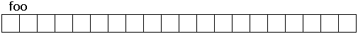
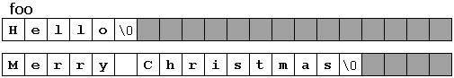

Pole

```c++
char foo [20];
```
  má kapacitu 20 prvkov typu char. Reprezentovať ho môžeme
 
 
 

Táto kapacita však nemusí byť úplne vyčerpaná. Napríklad v určitom 
okamihu
môže byť v poli foo uložená buď sekvencia "Hello"  
 alebo sekvencia
 "Vesele Vianoce"
 
  
  
 pretože obe sekvencie sa skladajú z menej ako 20 znakov.

 
 Podľa konvencie sa koniec reťazca reprezentuje špeciálnym znakom:
  nulovým znakom, ktorého hodnota je '\0'. 


## Inicializácia znakových sekvencií zakončených nullom

Pole znakov je možné inicializovať podľa rovnakých pravidiel ako akékoľvek iné 
pole - tj. tak, ako bolo zavedené
na minulej hodine:


```c++
char myword[] = { 'H', 'e', 'l', 'l', 'o', '\0' };
```
 je deklarácia poľa 6 prvkov typu char inicializovaných znakmi,
  ktoré tvoria slovo "Hello" plus nulovým znakom '\0' na konci.
  
  
Pole znakov je možné inicializovať aj ďalším spôsobom:
 priamo pomocou literálov, tj. pomocou textu v úvodzovkách.
 
 Príkladom literálu je napr. "toto je cele literal"

Literál je teda akási reťazcová koštanta. Literál je typu znakové pole 
zakončené nullom, a kvôli tomu má nulový znak '\0' vždy pripojený automaticky
na koniec. 

Preto sú nasledujúce spôsoby inicializácie znakového poľa sekvenciou znakov
zakončenou nullom ekvivalentné:

```c++
char myword[] = { 'H', 'e', 'l', 'l', 'o', '\0' };
char myword[] = "Hello"; 
```

V oboch prípadoch je pole znakov myword deklarované s kapacitou 6 
prvkov typu char: 5 znakov, ktoré tvoria slovo "Hello", plus posledný 
nulový znak ('\0'), ktorý určuje koniec (v druhom prípade pri 
použití dvojitých úvodzoviek (") sa automaticky pripojí).
 
 ! Platí iba pri inicializácii, tj. priradenie hodnoty v okamihu deklarovania
 poľa a nie neskôr

výrazy

```c++
myword = "Bye";
myword[] = "Bye";
myword = { 'B', 'y', 'e', '\0' };
```

sú nevalidné, kvôli tomu, že poľu nie je možné priradiť hodnotu. Je však
možné priradiť hodnotu jednotlivým prvkom poľa:

```c++
myword[0] = 'B';
myword[1] = 'y';
myword[2] = 'e';
myword[3] = '\0';
```

## String vs. sekvencie znakov zakončené nullom

Jednoduché polia s reťazcami znakov s nulovou koncovkou sú 
typické typy jazyka C, ktoré reprezentujú reťazce (preto sú tiež 
známe ako C-strings). V C ++, hoci štandardná knižnica definuje 
špecifický typ reťazcov (trieda string), sú tieto C-strings stále
 prirodzeným spôsobom reprezentácie
 reťazcov.

V štandardnej knižnici súčasne existujú obe reprezentácie reťazcov
  a väčšina funkcií, 
ktoré vyžadujú reťazce, sú preťažené, aby podporovali obe.

```c++
// pretazene funkcie
#include <iostream>
using namespace std;

int sum (int a, int b)
{
  return a+b;
}

double sum (double a, double b)
{
  return a+b;
}

int main ()
{
  cout << sum (10,20) << '\n';
  cout << sum (1.0,1.5) << '\n';
  return 0;
}
```

Napríklad cin a cout podporujú c-stringy aj stringy:


```c++
#include <iostream>
#include <string>
using namespace std;

int main ()
{
  char question1[] = "What is your name? ";
  string question2 = "Where do you live? ";
  char answer1 [80];
  string answer2;
  cout << question1;
  cin >> answer1;
  cout << question2;
  cin >> answer2;
  cout << "Hello, " << answer1;
  cout << " from " << answer2 << "!\n";
  return 0;
}

```
C-stringy a stringy sú pomerne zameniteľné v ich používaní 
spoločne s cinom a coutom, ale ich deklarácie sú značne 
rozdielne: polia majú pevnú veľkosť, ktorá sa pri deklarovaní musí 
špecifikovať buď implicitne, alebo explicitne; oquestion1 má veľkosť
 presne 20 znakov (vrátane ukončujúceho nulového znaku) a answer1 má 
 veľkosť 80 znakov; stringy sú jednoducho reťazce, žiadna 
 veľkosť nie je špecifikovaná. Je to spôsobené tým, že stringy majú 
 dynamickú veľkosť určenú počas behu programu, pričom
 veľkosť polí je určená počas kompilácie pred spustením programu.


 c-string a string možno transformovať jeden na druhý:
 
 


```c++
char myntcs[] = "some text";
string mystring = myntcs;  // konverzia c-string na string
cout << mystring;          // výpis stringu
cout << mystring.c_str();  // výpis c-stringu 
```

  